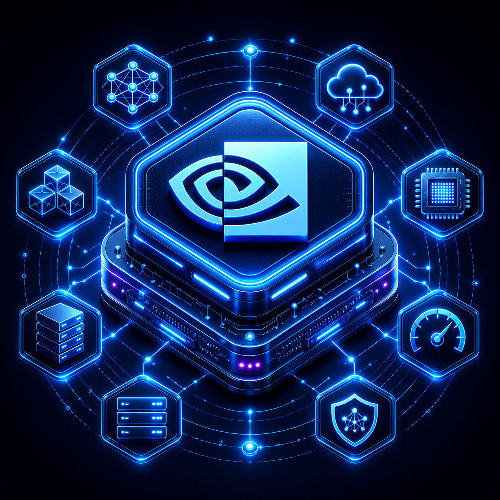

# NVIDIA Build Free Provider



Adds NVIDIA Build chat models validated for tool calls.

This is a root-layout Agent Zero community plugin. Agent Zero installs it from Git because `plugin.yaml` lives at the repository root.

## Install

In Agent Zero, use the Plugin Installer Git workflow with this repository URL:

```text
git@github.com:caelx/a0-nvidia-build-free-provider-plugin.git
```

After installation, enable `NVIDIA Build Free` in the Agent Zero plugin UI. The plugin registers the chat provider `nvidia_build_free` through `conf/model_providers.yaml`.

## Configuration

Set this environment variable before starting Agent Zero:

```bash
export NVIDIA_BUILD_FREE_API_KEY=your_api_key_here
```

The provider catalog endpoint is:

```text
https://integrate.api.nvidia.com/v1/models
```

## Validated Model Catalog

`catalog/validated_models.json` is the trusted baseline model catalog. CI refreshes this file by calling NVIDIA's live catalog and probing candidate models for tool-call support. The scheduled `Refresh NVIDIA Catalog` workflow commits changes directly to `main` when the validated model list changes.

Installed plugins can still add locally validated models to `state/tool_call_allow_cache.json` after installation. Local additions are runtime state only; they do not modify the repo unless the CI catalog refresh later validates and commits them.

## Development

```bash
uv run --with pytest --with httpx python -m pytest -s tests/unit
bash ci/run_agent_zero_integration.sh
```

Docker-backed integration requires a working Docker engine.

## CI Secrets

GitHub Actions requires this repository secret:

- `NVIDIA_BUILD_FREE_API_KEY`: API key used by required live provider CI.

If the secret is missing, CI fails with a message naming the required secret. Live catalog CI and the scheduled refresh upload `artifacts/nvidia-catalog-validation.json` with the full validated model catalog presented by this provider.

## Troubleshooting

- If no models appear, confirm `NVIDIA_BUILD_FREE_API_KEY` is present in the Agent Zero runtime environment.
- If installation fails, confirm Agent Zero can fetch this Git repository and that `plugin.yaml` remains at the repository root.
- If live CI fails with HTTP auth errors, rotate or re-add the `NVIDIA_BUILD_FREE_API_KEY` GitHub secret.
